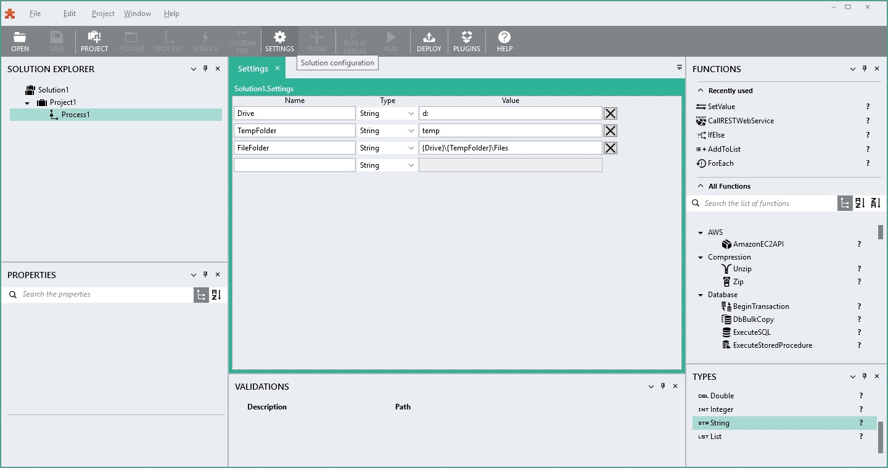

---
layout: docs
title: Settings
description: Settings
group: linx5main
feature: Tools
component: Settings
toc: true
redirect_from: docs/linx5main/Tools/Settings/index
---
Settings
========

Store your environment-specific values like connection strings, file
paths, passwords or URL's in settings. It makes it easier to change them
if they are stored in one place. Settings can be changed on the Linx
Server and will override the default settings in the solution.

Settings can refer to other settings by using the syntax {setting name}.
In the sample below the setting FileFolder will resolve to
"d:\\temp\\Files".

