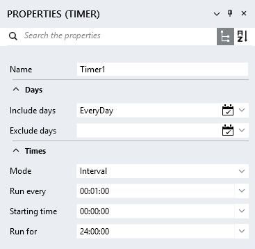
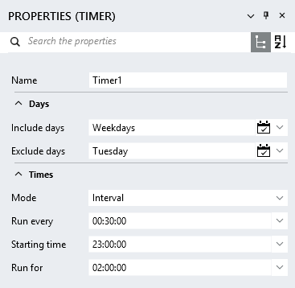
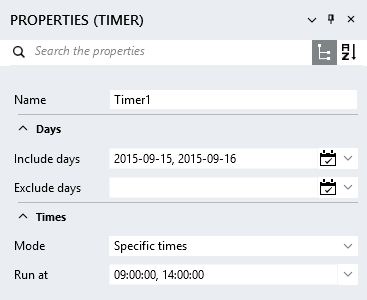

TimerService
===========

Allows the execution of a process at a specified time or interval.

Properties
----------
	
- #### Include days {#includedays-property}
Allow the user to specify a list of days on which the timer should run.  Possible values include *"EveryDay"* (Mon-Sun), *"Weekdays"* (Mon-Fri), or a comma-separated list of days or dates, e.g. *"Monday, Tuesday, Saturday"* or *"2015-05-09, 2015-05-15"* (date format yyyy-MM-dd).  You can either enter these values manually, or use the Include days editor to specify the allowed days.

-	#### Exclude days
Allow the user to specify a list of days on which the timer should not run.  See the [Include days](#includedays-property) property for possible values.  You can either enter these values manually, or use the Exclude days editor to specify the allowed days.

-  #### Mode
The execution mode of the timer.

	- ##### Interval {#interval-property}
    	Execute the timer at a fixed interval.  The interval can be configured by the following properties:

		- ###### Run every
			Specify the interval (time format HH:mm:ss) at which the timer should execute. E.g. *"00:00:30"* will create a timer that will execute every 30 seconds.
	
		- ###### Starting time
			Specify the starting time (time format HH:mm:ss) of the timer.  E.g. *"14:10:00"* will create a timer that will start execution at 10 minutes past two in the afternoon.
	
		- ###### Run for
			The duration (time format HH:mm:ss) that the timer will be active for.  E.g. *"00:45:00"* will create a timer that is active for 45 minutes. 
	
	- ##### Specific times {#specifictimes-property}
		Specify exact times at which the timer must execute.  The times can be configured by the following property: 

		- ###### Run at
			Specify the exact times (time format HH:mm:ss) in a comma-separated list of values.  E.g. *"09:10:00, 15:00:00"* will create a timer that will execute at 10 minutes past 9 in the morning, as well as at 3 o'clock in the afternoon.

Events
------

- #### TimerEvent
	Activated when the timer [interval](#interval-property) has elapsed, or when a [specific time](#specifictimes-property) has been reached. 

Examples
--------

<table>
	<tbody>
		<tr>
			<td style="border:none;"></td>
			<td style="vertical-align:middle;border:none;">
Execute every day (Mon-Sun), starting at 12 o'clock at night and run for 24 hours.  Interval execution times are: 
00:00:00 
01:00:00 
02:00:00 
... 
22:00:00 
23:00:00
			</td>
		</tr>
	</tbody>
</table>

<table>
	<tbody>
		<tr>
			<td style="border:none;"></td>
			<td style="vertical-align:middle;border:none;">
Execute every day of the week (Mon-Fri), excluding Tuesday, starting at 11 o'clock at night and run for 2 hours.  Interval execution times are: 
Monday 23:00:00 
Monday 23:30:00 
Tuesday 00:00:00 
Tuesday 00:30:00 
Wednesday 23:00:00 
Wednesday 23:30:00 
etc.  
Note that the exclusion day is used when determining the start time of the timer.  In this example there will be timer events on the Tuesday morning, because they form part of the interval range that started on the Monday night at 11 o'clock.  
			</td>
		</tr>
	</tbody>
</table>

<table>
	<tbody>
		<tr>
			<td style="border:none;"></td>
			<td style="vertical-align:middle;border:none;">
Execute on the 15th and 16th of September 2015 at 9 o'clock in the morning and 2 o'clock in the afternoon.
			</td>
		</tr>
	</tbody>
</table>
