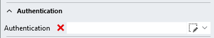
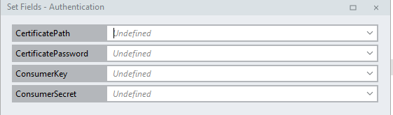
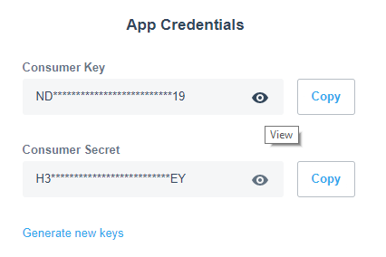

# Authentication
The authentication parameter specifies all the necessary information to authenticate the user against the desired Xero organization. 

### Setup
To be able to access a Xero organization via the API, you need to set up a private application in Xero's domain. If you haven't done so, please visit your [applications portal](https://app.xero.com/Application) and click `Add Application`.

While setting up the private application, make sure you save the following elements, as you will need them to set the authentication values:
- Public certificate file in PFX format.
- The password to the public certificate.
- ConsumerKey provided by the Xero API configuration.
- ConsumerSecret provided by the Xero API configuration.

### Value Specification
The authentication parameter is the first property on every Xero function. To set its values simply click on the small editor icon to the right of its name.

You will be prompted for the following values:

- CertificatePath: this is the path to the location of the public certificate in PFX format on your harddrive.
- CertificatePassword: this is the password to the public certificate provided in CertificatePath.
- ConsumerKey: Consumer Key credentials for your private application provided by Xero.
- ConsumerSecret: Consumer Secret credentials for your private application provided by Xero.

